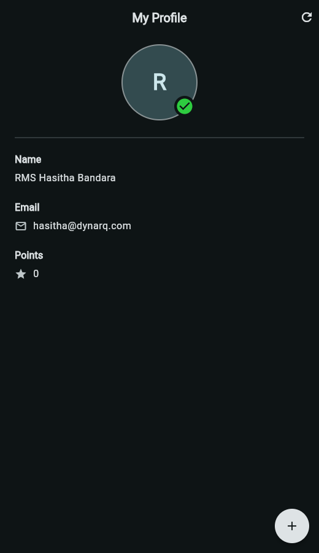

# My Profile (MAD In Class Activity 02)

A single screen Flutter app that shows a user profile card: avatar with a
verified badge, name, email and a points counter. The floating action button
awards a point, the refresh action in the app bar clears the counter.

Module: Mobile Application Development, NSBM, Semester 5.

## Screen



App bar with a centred title and a reset action, avatar with a verified badge,
a divider, then the Name, Email and Points rows. The floating action button
adds a point. The shot above is the web build, which picks up the dark theme
from the system setting; on a phone in light mode the same screen is white.

## Layout of the code

| Path | Purpose |
| --- | --- |
| `lib/main.dart` | App entry point, theme and the profile that is loaded at start |
| `lib/models/user_profile.dart` | Immutable profile value object with `copyWith` and equality |
| `lib/state/profile_controller.dart` | `ValueNotifier` holding the profile, award and reset rules |
| `lib/screens/profile_screen.dart` | The screen itself, rebuilt through `ValueListenableBuilder` |
| `lib/widgets/profile_avatar.dart` | Round avatar with ring and verified badge |
| `lib/widgets/profile_field.dart` | One label plus value row, optional leading icon |
| `test/profile_test.dart` | Unit tests for the controller, widget tests for the screen |

State is kept in a `ValueNotifier` rather than `setState` so the award rules
can be tested on their own, and so only the body of the screen rebuilds when
the counter changes. Points are capped at 999 and the cap shows a snack bar
instead of silently doing nothing.

## Running it

Requires Flutter 3.19 or newer (Dart SDK 3.3).

```bash
flutter pub get
flutter run
```

The repository carries `lib`, `test` and the Android host project. The Gradle
wrapper binary is not committed, so on a fresh clone run:

```bash
flutter create .
```

That fills in the generated wrapper and any other platform folders you need
(iOS, web, desktop) without touching anything under `lib`.

## Tests

```bash
flutter test
```

Six tests: three on `ProfileController` (award, cap, reset) and three widget
tests (details render, the button raises the counter, refresh clears it).

Verified on Flutter 3.47.3 stable with Dart 3.13.3: `flutter analyze` reports
no issues and all 6 tests pass.
